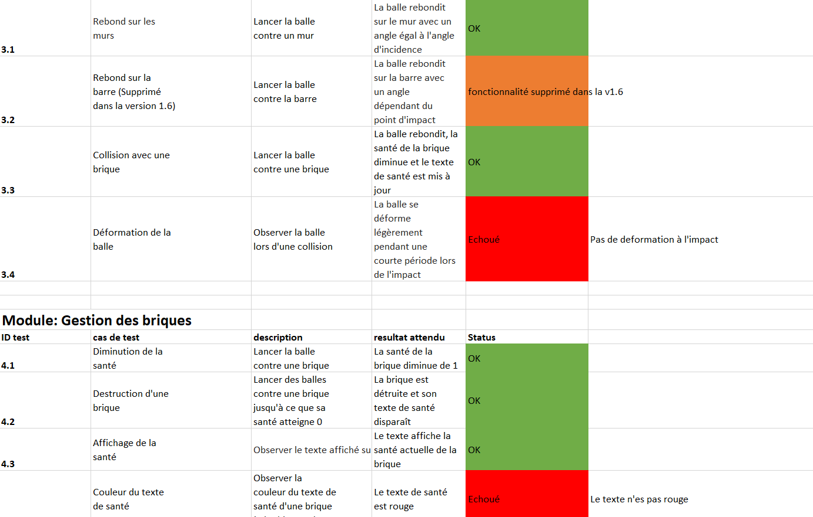
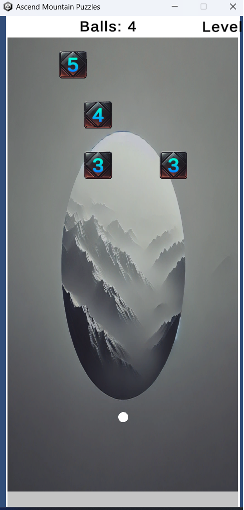

Le but de ce TP est de rédiger un premier rapport de test. 
L'application testée est un jeu de casse brique en cour de developpement sous Unity destiné à Android

Le plan de test et mon rapport son consultables dans ce repository

## Rédaction d'un rapport de test app Android 
 - Test fonctionnel/exploratoire d'une application de jeu sous Android
 - Analyse du plan de test
 - Analyse des cas de test pour chaques fonctionnalités
 - Création d'un rapport de test clair et annoté

